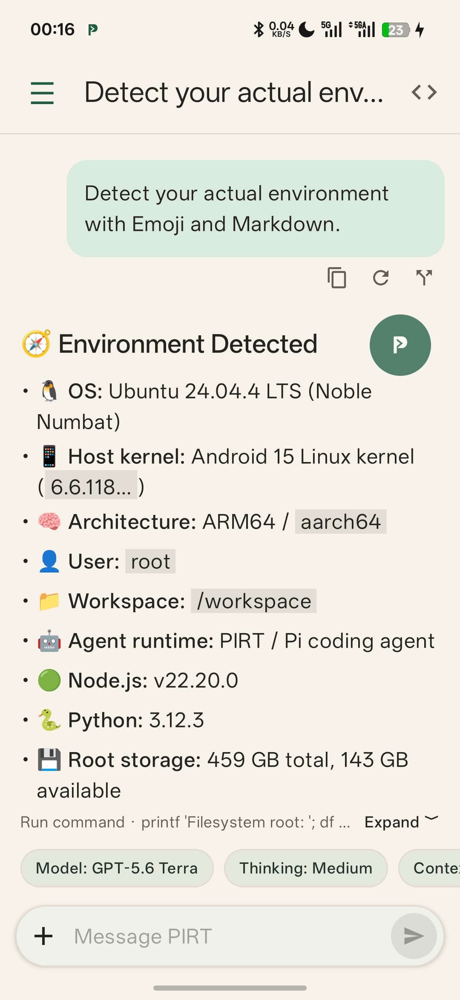
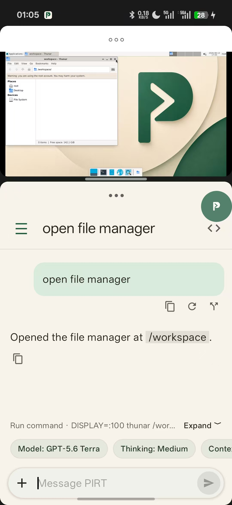

# PIRT — Pi Runtime on PRoot

**An AI-powered Linux computer in your pocket.**

English · [简体中文](README.zh-CN.md)

PIRT gives your Android phone a local Linux environment that an AI Agent can actually use: run commands, work with files, use development tools and operate an XFCE desktop.

Everything runs on the phone. Pi works inside Debian on PRoot, while PIRT connects the Agent runtime, Android app lifecycle, shell, desktop and persistent `/workspace` into one system. Workspace files are also directly available to Android's system file manager and other apps.

[Download the latest APK](https://github.com/ZIXT233/PIRT/releases/latest)

<p align="center">
  
</p>

## What it does

- Runs Debian 13.6 locally on ARM64 Android devices through PRoot; root access is not required.
- Runs Pi and its tools inside that Debian environment instead of forwarding commands to another computer.
- Stores project files in one persistent `/workspace` shared by the agent, shell and XFCE desktop.
- Exposes that workspace to Android's Storage Access Framework, so system file managers and compatible apps can use the original files directly.
- Runs independent background processes that are not tied to a conversation. They can host long-running tasks such as a Minecraft server, and can be viewed or stopped from PIRT's process list.
- Uses an optional floating overlay to keep the local runtime active when Android would otherwise freeze it in the background.
- Keeps Pi's real session history and can resume previous conversations.

The practical difference is where the work happens. A remote-agent workflow needs another machine and a way to transfer or synchronize its files. PIRT executes on the phone and keeps the working files there.

## Advanced use: Android over ADB

Provide the Agent with the pairing code and ports shown by Android Wireless debugging. The Agent can then pair through ADB from the Debian environment and control the phone for device inspection and automation.

## Local runtime controls

- A persistent shell and local XFCE desktop, accessible in a browser through noVNC or with VNC clients such as aVNC
- Independent process creation, status inspection and termination
- Conversation management, context/token usage and HTML export
- Provider sign-in, OpenAI-compatible APIs and model selection
- Completion notifications and notification-bar input

<p align="center">
  
  <br>
  <sub>PIRT and aVNC in Android split-screen mode. The same desktop can also be opened in a browser through noVNC.</sub>
</p>

## Requirements

- Android 7.0 or later
- An ARM64 (`arm64-v8a`) device
- Enough free storage for the APK and the extracted Debian environment
- An account or API key for a supported AI provider

PIRT does **not** require root access. The current release is distributed as a large APK because the initial Rootfs image is bundled for offline installation.

## Install

1. Download the latest signed ARM64 APK from [GitHub Releases](https://github.com/ZIXT233/PIRT/releases).
2. Allow your browser or file manager to install unknown apps when Android asks.
3. Install and open PIRT.
4. Wait for the bundled environment to be verified and extracted on first launch.
5. Sign in to an AI provider or add an OpenAI-compatible API, then select a model.

Enable PIRT's floating overlay when a Pi conversation or independent process must continue running while the app is in the background. The overlay is also required for browser-based sign-in to receive the authorization result after switching apps. Device-code sign-in does not depend on it.

## How it works

```text
Android / Jetpack Compose
          │
          ├── conversations, files, notifications and overlay
          │
      PIRT runtime service
          │
          ├── Pi SDK session host
          ├── persistent shell and processes
          └── local XFCE desktop
                    │
             Debian on PRoot
                    │
               /workspace
```

Pi owns the conversation history and agent lifecycle. PIRT owns the Android lifecycle, local runtime, shared workspace and mobile presentation. Technical details are available in [the architecture document](docs/architecture.md).

## Runtime

| Component | Version |
| --- | --- |
| Debian | 13.6 |
| Pi coding agent | 0.84.1 |
| Node.js | 22.20.0 |
| Python | 3.13 |
| XFCE | 4.20 |
| PRoot | 5.1.107.89 |

The bundled initial Rootfs image is verified with SHA-256 before extraction. The installed environment is writable, so the initial image checksum is not a checksum of the environment after use. See the [Rootfs build guide](docs/rootfs-build.md) to rebuild the image from public sources.

## Status

PIRT is an early project. Back up important files in the workspace before upgrading or experimenting with the runtime. Bug reports and practical feedback are welcome in [Issues](https://github.com/ZIXT233/PIRT/issues).

## Author

Created and maintained by [ZIXT](https://github.com/ZIXT233).
