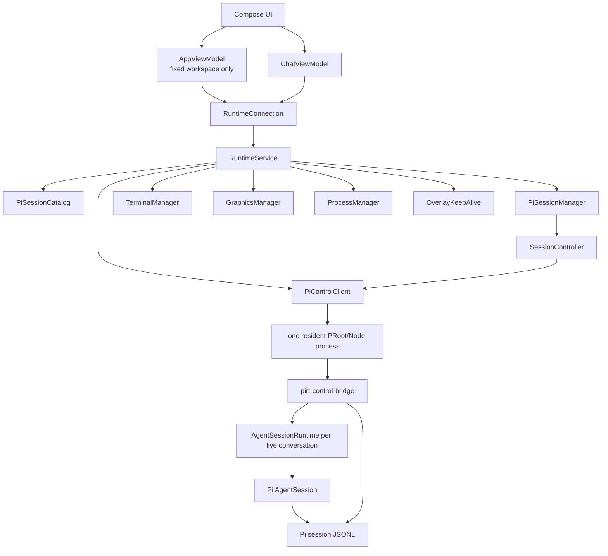
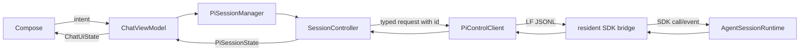

# PIRT architecture

English · [简体中文](architecture.zh-CN.md)

PIRT is an Android projection of Pi running in one app-private Debian PRoot environment. Pi owns conversations; PIRT owns the Android lifecycle, the shared workspace, and presentation.

## Ownership



There is no Android conversation database and no `workspace.json`. The fixed workspace is `files/pirt/workspace`. Pi JSONL under the Debian rootfs is the only persisted conversation catalog and history.

`RuntimeService` owns one resident PRoot/Node process through `PiControlClient`. That process imports the Pi SDK once and owns authentication, models, the catalog, and all live `AgentSessionRuntime` instances. Opening or switching conversations does not create another OS process. Activities bind through `RuntimeConnection`; Compose never owns the Node process or SDK sessions.

`RuntimeService` also owns the persistent shell, graphical desktop, process projection, notification, and overlay. These components therefore do not follow the lifecycle of an individual Compose page. The service runs in the app process and promotes itself with one foreground notification; it is not a separate Android process.

Each live conversation has one `AgentSessionRuntime`. Runtime replacement operations use Pi's own lifecycle (`session_before_fork`, `session_shutdown`, `session_start`) and rebind extension/event subscriptions to the replacement `AgentSession`. Deletion and service shutdown dispose runtimes; ordinary UI navigation keeps them alive for fast switching.

The drawer has one stable `New conversation` pre-submit slot, separate from Pi's persisted catalog. Its composer text and claimed warm child survive navigation to historical conversations. Submitting promotes that runtime handle to a transient live row immediately and creates a fresh empty slot; once Pi's JSONL appears, the row is replaced by the matching `SessionManager.list()` result. This transient projection is never persisted as an Android conversation catalog.

## New conversation flow

```mermaid
sequenceDiagram
    participant UI as Compose
    participant M as PiSessionManager
    participant P as Pi SDK host
    participant C as PiSessionCatalog
    UI->>M: open stable pre-submit slot
    M->>P: create AgentSessionRuntime
    P-->>M: state includes Pi-generated sessionId and cached model
    UI->>P: first prompt
    UI->>UI: promote draft to transient live row; create fresh slot
    P->>P: first assistant message flushes JSONL
    M->>C: refresh after agent_settled
    C->>P: SessionManager.list(/workspace, sessionDir)
    C-->>UI: Pi id, name, firstMessage, timestamps, count, path
```

Before Pi returns its identity, Android has only an ephemeral runtime handle so the process can receive commands. That handle is not a session ID and is never persisted. PIRT does not pass `--session-id` or `--name` for a new session. Pi generates the ID; the display name comes from Pi's latest `session_info`, falling back to Pi's `firstMessage`.

Persisted sessions resume with their Pi JSONL path. Renaming uses Pi RPC `set_session_name` for a live process or `SessionManager.open(...).appendSessionInfo(...)` for an inactive one. Deleting removes that Pi JSONL. There is no archive state; the drawer shows the newest 20 sessions and can expand the rest.

## Chat data flow



`PiControlClient` correlates every response by request ID and command. `SessionController` is the only event reducer. Stderr and unsupported events go to runtime diagnostics, not chat.

## Other Pi-owned data

The resident `pirt-control-bridge.mjs` calls Pi `SessionManager`, `ModelRuntime`, and `SettingsManager`. Android keeps only UI projections and request correlation; it does not maintain a provider registry, credential store, model catalog, conversation catalog, agent loop, or session parser.

Conversation operations are narrow JSON commands over the resident bridge and map directly to Pi SDK methods. Fork uses `AgentSessionRuntime.fork(entryId)`, clone uses `fork(leafId, { position: "at" })`, and steering uses `AgentSession.steer()`. Android projects Pi JSONL entries and their real `entryId`; it does not maintain a parallel branch or queue model.

For every new Pi-related feature, check the pinned Pi source first. If Pi already owns the data or operation, expose that implementation through a narrow bridge or RPC projection instead of creating parallel Android state.

## Runtime filesystem

```text
files/pirt/
  workspace/                         shared host workspace
  runtime/
    debian/
      root/.pi/pirt-sessions/*.jsonl Pi-owned catalog and history
      root/.pi/agent/                 Pi settings and credentials
    native-links/
```

Every Pi process, terminal, and desktop mounts the same host workspace at `/workspace`. Conversations isolate Pi history, not files. PIRT does not manage Git repositories, branches, worktrees, checkpoints, diffs, or rollback.

`WorkspaceDocumentsProvider` projects that same app-private workspace into Android's Storage Access Framework as the `PIRT / Workspace` document root. System file managers and SAF-aware apps operate on the original files through content URIs; PIRT does not copy, mirror, or relocate the workspace.

## Long-running processes and background activity

Commands started in the Debian environment are not owned by a Pi conversation. They can continue after the user switches conversations or leaves the chat page, which allows workloads such as a Minecraft server to run independently. `ProcessManager` projects the host/PRoot process tree into the UI and can terminate a selected process; it does not store a second process database.

`RuntimeService` keeps the runtime visible to Android through its foreground notification. It holds a partial wake lock only while a Pi session is busy or the persistent terminal is active, and releases it when those conditions end. When enabled, the application overlay keeps the app active while it is in the background and exposes compact chat/process controls. The overlay and service improve background continuity but remain subject to Android's process-management policy.

## Graphical desktop

`GraphicsManager` starts one service-owned graphics stack inside the same PRoot environment:

```text
XFCE on DISPLAY=:100
        ↓
TigerVNC on 127.0.0.1:6000
        ↓
websockify + noVNC on 127.0.0.1:16000
```

The display number is fixed by `PRootRuntime.GRAPHICS_DISPLAY = 100`; Pi and terminal processes also receive `DISPLAY=:100`. The VNC and noVNC listeners bind to localhost. The Android UI can open noVNC in a browser or pass the local VNC address and password to a client such as aVNC.

The PIRT environment prompt tells the Agent to prefer `DISPLAY=:100` for desktop inspection, screenshots, and GUI interaction. If that display is unavailable, it asks the user to start **Desktop** from the app sidebar rather than guessing another display.
