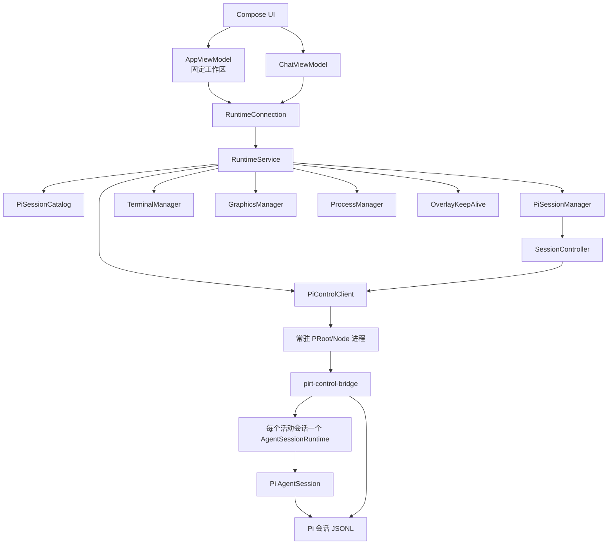
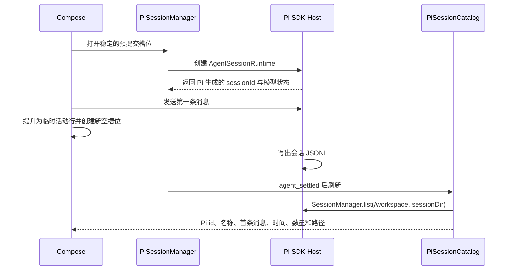
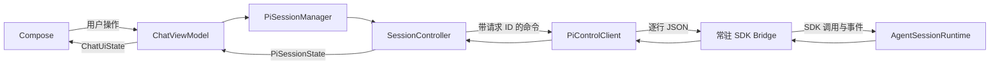

# PIRT 架构

[English](architecture.md) · 简体中文

PIRT 把运行在应用私有 Debian PRoot 环境中的 Pi 投射为 Android 应用。Pi 负责会话；PIRT 负责 Android 生命周期、共享工作区和移动端呈现。

## 组件归属



Android 端没有会话数据库，也没有 `workspace.json`。固定工作区是 `files/pirt/workspace`；Debian Rootfs 中的 Pi JSONL 是唯一持久化会话目录和历史。

`RuntimeService` 通过 `PiControlClient` 持有一个常驻的 PRoot/Node 进程。该进程只加载一次 Pi SDK，并持有认证、模型、会话目录和所有活动的 `AgentSessionRuntime`。打开或切换会话不会创建新的系统进程。Activity 通过 `RuntimeConnection` 绑定服务，Compose 页面不持有 Node 进程或 SDK 会话。

`RuntimeService` 还持有持久 Shell、图形桌面、进程投影、通知和悬浮窗，所以离开某个 Compose 页面不会停止这些组件。服务与界面运行在同一个 Android 进程中，通过一条前台通知提高进程重要性，并非独立 Android 进程。

每个活动会话对应一个 `AgentSessionRuntime`。fork 等替换运行时的操作使用 Pi 自身的生命周期事件，并把扩展与事件订阅重新绑定到新的 `AgentSession`。删除会话或关闭服务时会释放运行时；普通页面切换不会释放，以便快速恢复。

侧边栏中的“新会话”是一个尚未提交的稳定槽位，与 Pi 已持久化的会话目录分开。首次发送后，它会立即成为临时活动行，同时创建新的空槽位；Pi 写出 JSONL 后，再由 `SessionManager.list()` 返回的真实记录替换。Android 不会把这个临时投影持久化为另一套会话目录。

## 新会话流程



Pi 返回身份之前，Android 只持有用于发送命令的临时运行时句柄。它不是会话 ID，也不会持久化。PIRT 不为新会话传入 `--session-id` 或 `--name`：ID 由 Pi 生成，显示名称优先采用 Pi 最新的 `session_info`，否则使用 `firstMessage`。

恢复历史会话时使用 Pi JSONL 路径。重命名活动会话通过 Pi RPC `set_session_name`，非活动会话通过 `SessionManager.open(...).appendSessionInfo(...)`。删除操作删除对应 JSONL。当前没有归档状态；侧边栏默认显示最新 20 个会话，可继续展开。

## 对话数据流



`PiControlClient` 使用请求 ID 和命令类型关联响应；`SessionController` 是唯一的事件归并器。stderr 和不支持的事件进入运行诊断，不进入对话气泡。

## 其他由 Pi 持有的数据

常驻的 `pirt-control-bridge.mjs` 调用 Pi 的 `SessionManager`、`ModelRuntime` 和 `SettingsManager`。Android 只保留 UI 投影和请求关联，不另行维护服务商注册表、凭据存储、模型目录、会话目录、Agent 循环或会话解析器。

会话操作通过窄 JSON 命令映射到 Pi SDK。fork 使用 `AgentSessionRuntime.fork(entryId)`，clone 使用 `fork(leafId, { position: "at" })`，steering 使用 `AgentSession.steer()`。Android 投影 Pi JSONL 中的真实 `entryId`，不再维护平行的分支或队列模型。

新增 Pi 相关功能前应先检查项目锁定版本的 Pi 源码。如果数据或操作已经由 Pi 持有，应通过窄 Bridge/RPC 暴露，而不是在 Android 端建立第二套状态。

## 运行时文件系统

```text
files/pirt/
  workspace/                         宿主共享工作区
  runtime/
    debian/
      root/.pi/pirt-sessions/*.jsonl Pi 会话目录与历史
      root/.pi/agent/                 Pi 设置与凭据
    native-links/
```

所有 Pi 会话、Shell 和桌面把同一个宿主目录挂载为 `/workspace`。会话只隔离 Pi 历史，不隔离文件。PIRT 不管理 Git 仓库、分支、worktree、检查点、diff 或回滚。

`WorkspaceDocumentsProvider` 通过 Android 存储访问框架把同一应用私有工作区公开为 `PIRT / Workspace` 文档根目录。系统文件管理器和支持 SAF 的应用通过 content URI 操作原文件；PIRT 不复制、镜像或搬移工作区。

## 后台独立进程与保活

Ubuntu 环境中启动的命令不归属于某个 Pi 会话。切换会话或离开对话页面后，它们仍可继续运行，因此可以承载 Minecraft 服务端等长期任务。`ProcessManager` 把宿主/PRoot 进程树投影到界面，并可终止指定进程；它不维护第二套进程数据库。

`RuntimeService` 通过前台通知让 Android 明确感知正在运行的本地环境。只有 Pi 会话忙碌或持久终端活跃时才持有 partial WakeLock，条件结束后立即释放。用户开启悬浮窗后，应用在后台时可继续保持活跃，并提供紧凑的会话与进程入口。前台服务和悬浮窗可以改善后台连续性，但仍受 Android 进程管理策略约束。

## 图形桌面

`GraphicsManager` 在同一个 PRoot 环境中启动一套由服务持有的图形栈：

```text
XFCE on DISPLAY=:100
        ↓
TigerVNC on 127.0.0.1:6000
        ↓
websockify + noVNC on 127.0.0.1:16000
```

显示号固定为 `PRootRuntime.GRAPHICS_DISPLAY = 100`，Pi 和终端进程也会收到 `DISPLAY=:100`。VNC 与 noVNC 只监听 localhost。Android 界面既可以在浏览器中打开 noVNC，也可以把本地 VNC 地址和密码交给 aVNC 等客户端。

PIRT 环境提示要求 Agent 在桌面检查、截图和 GUI 操作中优先使用 `DISPLAY=:100`。如果该显示不可用，Agent 应请用户从应用侧边栏启动“桌面”，而不是猜测其他显示号。
